# Aplikasi Web Sistem Absensi Sekolah Berbasis QR Code

Aplikasi Web Sistem Absensi Sekolah Berbasis QR Code adalah sebuah proyek yang bertujuan untuk mengotomatisasi proses absensi di lingkungan sekolah menggunakan teknologi QR code. Aplikasi ini dikembangkan dengan menggunakan framework CodeIgniter 4 dan didesain untuk mempermudah pengelolaan dan pencatatan kehadiran siswa dan guru.


Proyek kami adalah implementasi pipeline CI/CD untuk aplikasi Sistem Presensi berbasis QR Code. Tujuannya adalah untuk mengotomatiskan seluruh proses, mulai dari saat kode diunggah ke GitHub, lalu secara otomatis diuji, dikemas dengan Docker, hingga di-deploy ke server. Dengan ini, kami bisa merilis pembaruan fitur dengan lebih cepat, efisien, dan andal.

## Fitur Utama

- **QR Code scanner.** Setiap siswa/guru menunjukkan qr code kepada perangkat yang dilengkapi dengan kamera. Aplikasi akan memvalidasi QR code dan mencatat kehadiran siswa ke dalam database.
- **Notifikasi Presensi via WhatsApp**. Setelah berhasil scan dan presensi, pemberitahuan dikirim ke nomor hp siswa melalui whatsapp.
- **Login petugas.**
- **Dashboard petugas.** Petugas sekolah dapat dengan mudah memantau kehadiran siswa dalam periode waktu tertentu melalui tampilan yang disediakan.
- **QR Code generator & downloader.** Petugas yang sudah login akan men-generate dan/atau mendownload qr code setiap siswa/guru. Setiap siswa akan diberikan QR code unik yang terkait dengan identitas siswa. QR code ini akan digunakan saat proses absensi.
- **Ubah data absen siswa/guru.** Petugas dapat mengubah data absensi setiap siswa/guru. Misalnya mengubah data kehadiran dari `tanpa keterangan` menjadi `sakit` atau `izin`.
- **Tambah, Ubah, Hapus(CRUD) data siswa/guru.**
- **Tambah, Ubah, Hapus(CRUD) data kelas.**
- **Lihat, Tambah, Ubah, Hapus(CRUD) data petugas.** (khusus petugas yang login sebagai **`superadmin`**).
- **Generate Laporan.** Generate laporan dalam bentuk pdf.
- **Import Banyak Siswa.** Menggunakan CSV delimiter koma (,), Contoh: [CSV](https://github.com/ikhsan3adi/absensi-sekolah-qr-code/blob/141ef728f01b14b89b43aee2c0c38680b0b60528/public/assets/file/csv_siswa_example.csv).

## Tools yang digunakan
Tentu, berikut adalah penjelasan untuk setiap tools yang digunakan dalam diagram alur kerja (workflow diagram) tersebut:

## Tools yang Digunakan
### GitHub
GitHub digunakan sebagai platform berbasis web yang menggunakan Git untuk kontrol versi. Dalam diagram ini, GitHub berfungsi sebagai repositori sentral untuk menyimpan, mengelola, dan melacak setiap perubahan pada kode sumber aplikasi.
### GitHub Actions
Github Actions digunakan untuk menjalankan pipeline CI/CD. Pipeline berfungsi sebagai proses otomasi yang menjalankan serangkaian langkah (seperti build, test, dan deploy) setiap kali ada perubahan kode di GitHub. Logo yang digunakan mirip dengan Bitbucket Pipelines atau bisa juga merepresentasikan konsep pipeline CI/CD secara umum (misalnya, Jenkins, GitHub Actions, dll.). Tujuannya adalah untuk mengintegrasikan dan mengirimkan kode secara berkelanjutan.
### Composer
Composer digunakan sebagai manajer dependensi (dependency manager) untuk bahasa pemrograman PHP. Dalam alur ini, pipeline menggunakan Composer untuk mengunduh dan menginstal semua pustaka (libraries) atau paket eksternal yang dibutuhkan oleh proyek aplikasi agar dapat berjalan dengan baik.
### PHPUnit
PHPUnit berfungsi sebagai kerangka kerja pengujian (testing framework) untuk PHP. Setelah Composer menginstal semua dependensi, PHPUnit secara otomatis menjalankan tes pada kode untuk memastikan tidak ada bug atau kesalahan dan semua fungsi berjalan sesuai harapan.
### Docker
Docker berfungsi sebagai platform untuk mengemas aplikasi beserta semua dependensinya (pustaka, runtime, tools) ke dalam sebuah unit standar yang disebut container. Dalam alur ini, kode dari GitHub "dibungkus" menjadi sebuah Docker image, yang memastikan aplikasi dapat berjalan secara konsisten di lingkungan mana pun.
### Amazon Elastic Container Registry (ECR)
ECR adalah layanan registry container Docker yang dikelola oleh Amazon Web Services (AWS). Setelah Docker image berhasil dibuat, gambar tersebut diunggah dan disimpan di ECR. Ini berfungsi sebagai tempat penyimpanan terpusat untuk semua versi image aplikasi.
### Ansible
Ansible digunakan sebagai alat otomasi open-source untuk manajemen konfigurasi dan penyebaran aplikasi. Dalam diagram ini, Ansible bertugas mengambil (pull) Docker image dari Amazon ECR dan secara otomatis melakukan deployment (menjalankan kontainer) ke server tujuan.
### Amazon Elastic Compute Cloud (EC2)
EC2 adalah layanan dari AWS yang menyediakan server virtual (virtual servers) yang dapat diskalakan di cloud. Di sinilah aplikasi yang sudah dikemas dalam kontainer Docker akan dijalankan dan diakses oleh pengguna.
### Amazon CloudWatch
CloudWatch adalah layanan pemantauan dan observabilitas dari AWS. Layanan ini mengumpulkan data log, metrik, dan events dari sumber daya AWS seperti EC2. Tujuannya adalah untuk memantau kinerja dan kesehatan aplikasi yang sedang berjalan, serta memberikan peringatan jika terjadi masalah.

## Pipeline Workflow DIagram
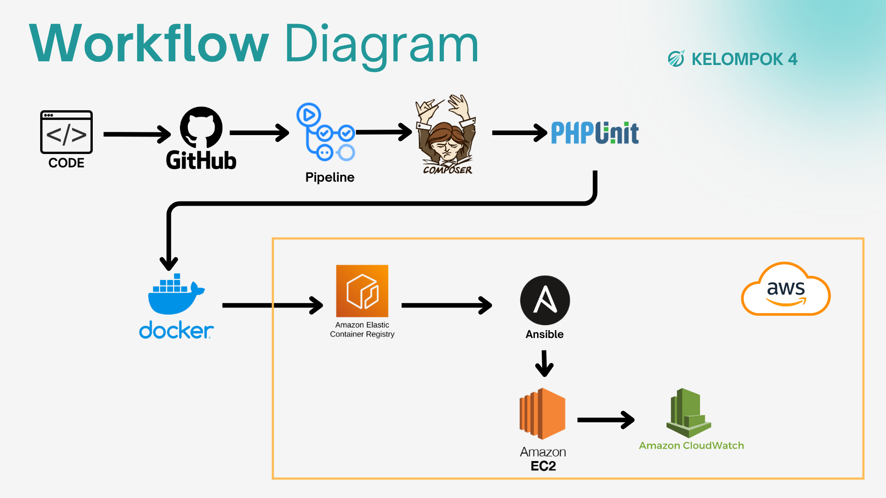

## Dokumentasi Screenshot Pipeline

### CI/CD Pipeline GitHub Actions

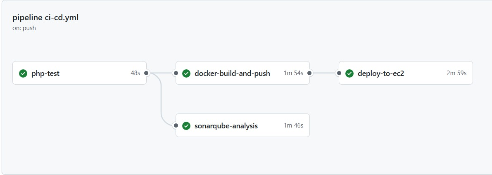

### Job php-test

| php-test di GitHub Actions                          |                       Code                      |
| -------------------------------------------------- | :----------------------------------------------: |
| 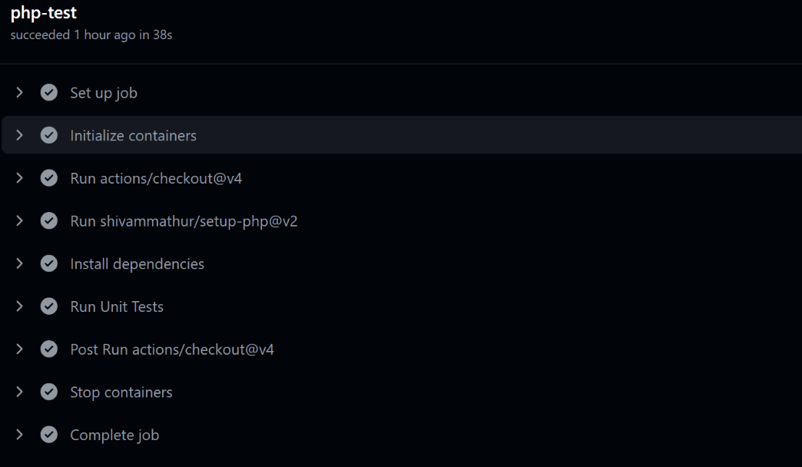 | 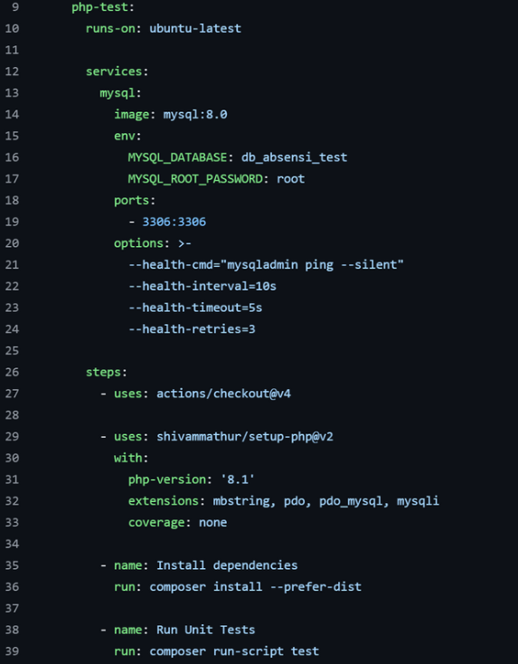 |

Job ini bertanggung jawab untuk menjalankan pengujian pada kode PHP, seperti unit test dan integration test. Tujuannya adalah untuk memastikan bahwa setiap perubahan kode tetap sesuai dengan fungsionalitas yang diharapkan, serta mengurangi potensi bug di tahap produksi.

### Job sonarqube-analysis

| sonarqube-analysis di GitHub Actions                          |                       Code                      |
| -------------------------------------------------- | :----------------------------------------------: |
| 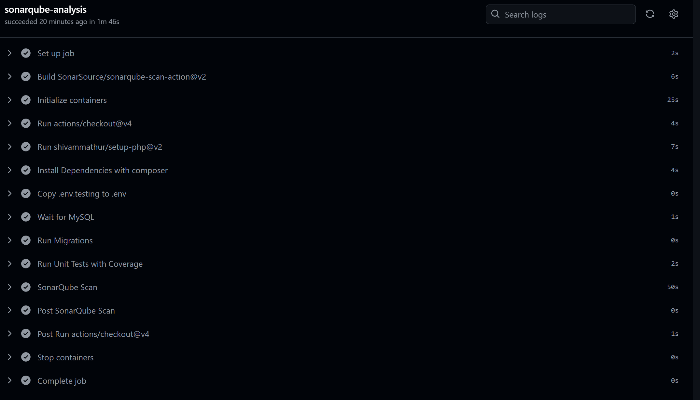 | 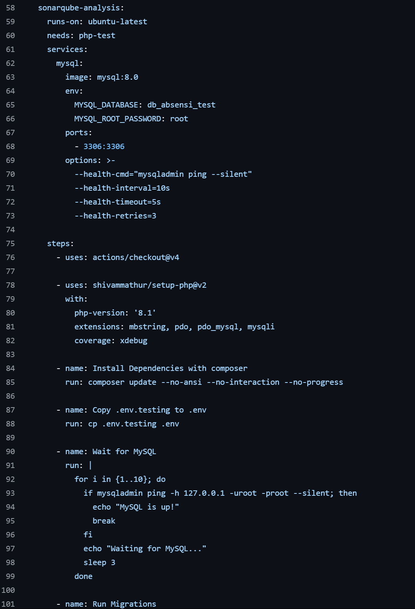 |

Job ini menjalankan analisis kualitas kode menggunakan SonarQube. Proses ini membantu mendeteksi potensi permasalahan seperti technical debt, kerentanan keamanan, serta menjaga standar kualitas kode dalam jangka panjang.

### Job docker-build-and-push

| docker-build-and-push di Github Action                          |                       Code                      |
| -------------------------------------------------- | :----------------------------------------------: |
| 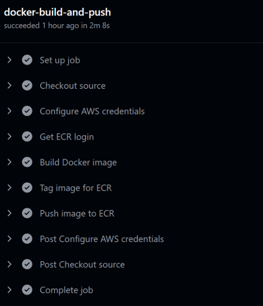 | 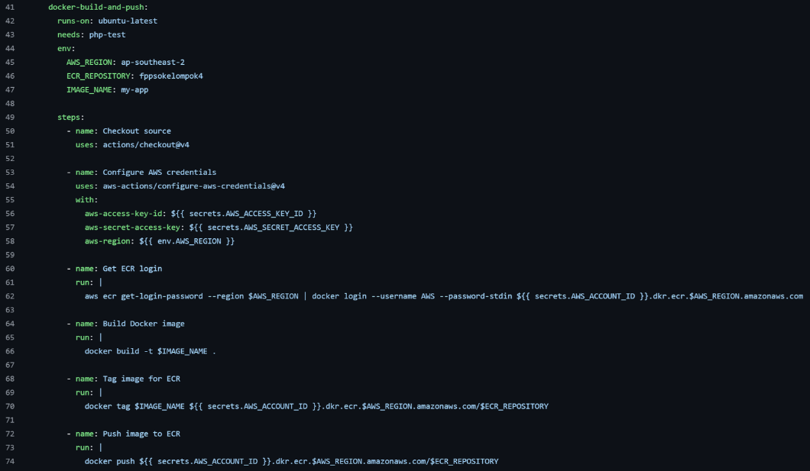 |

Setelah kode berhasil lolos pengujian, job ini akan membangun image Docker dari aplikasi, kemudian mendorong (push) image tersebut ke container registry. Hal ini memungkinkan image terbaru dapat digunakan untuk deployment di berbagai lingkungan.

### Job deploy-to-ec2

| deploy-to-ec2 di Github Action                          |                       Code                      |
| -------------------------------------------------- | :----------------------------------------------: |
| 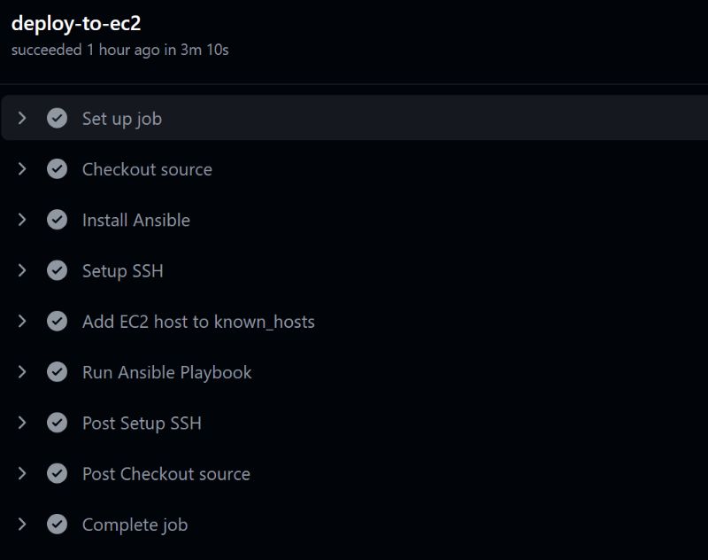 | 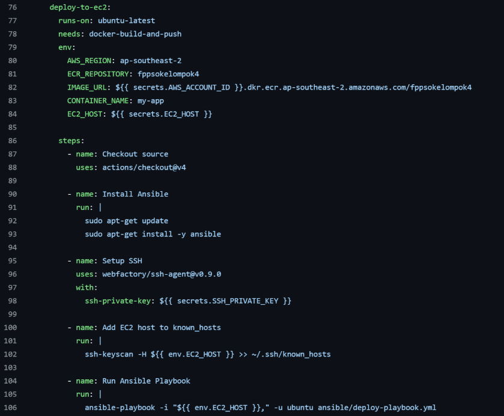 |

Job ini bertugas untuk melakukan deployment ke server EC2. Proses deployment dilakukan dengan menarik (pull) image terbaru dari container registry dan menjalankannya di server target, sehingga aplikasi yang berjalan selalu diperbarui dengan versi terbaru dari repository.

## Dokumentasi Setup Tools

### Konfigurasi Database RDS

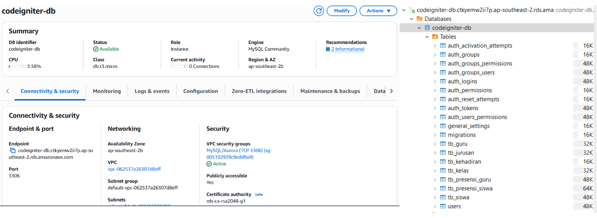

Kami menggunakan Database RDS di AWS dengan engine MySQL. Bagian Connectivity & Security mengunakan Endpoint dan port 3306 agar terkoneksi dengan server.

### Konfigurasi EC2 - Security

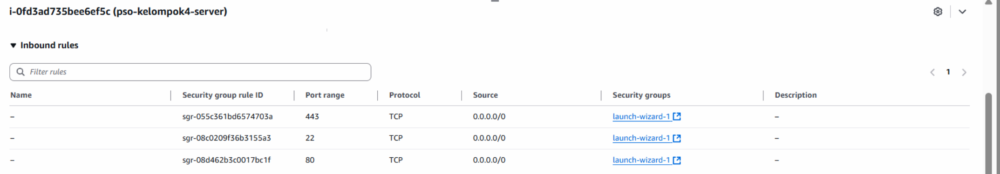

Rules security dari cloud server diatur agar dapat menerima request dari client ke 
port 80 - HTTP, port 443 - HTTPS, dan port 22 - SSH.

### Konfigurasi EC2 - Public IP

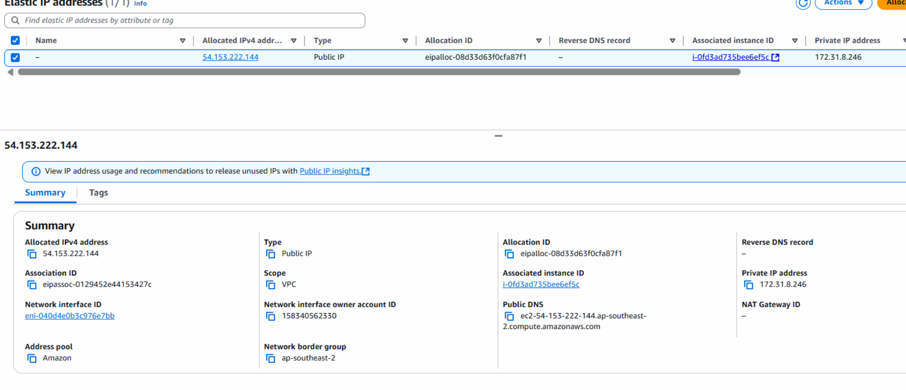

Kami mengatur alamat public IP menggunakan Elastic IP pada EC2 di AWS, yang dialokasikan untuk instance pso-kelompok4-server, memungkinkan akses dari internet dengan IP tetap.

### Konfigurasi ECR

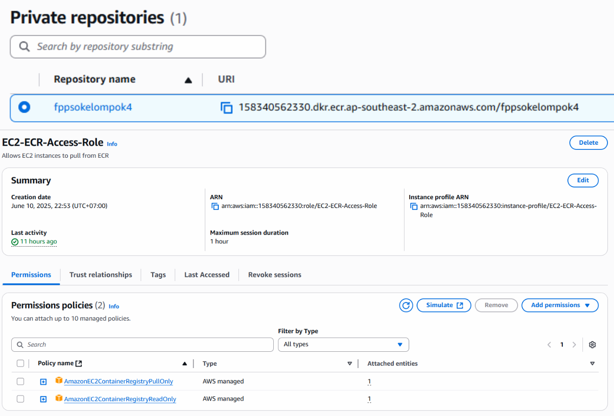

Amazon ECR (Elastic Container Registry) menyimpan Docker image yang di build ke dalam repository kami yaitu fppsokelompok4. Akses ke repository ini diatur melalui peran EC2-ECR-Access-Role, yang memungkinkan instance EC2 untuk menarik image dari ECR.

### Dockerfile

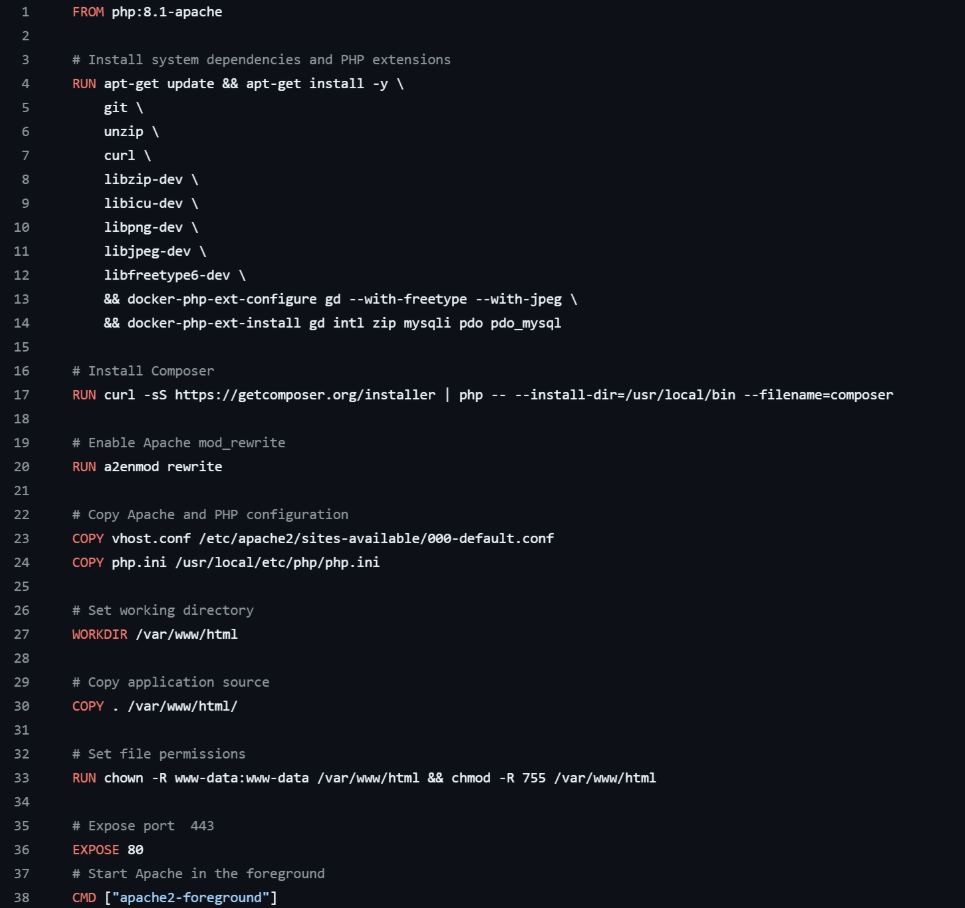

Gambar diatas merupakan setup dockerfile yang digunakan untuk mengatur build image docker agar container dijalankan di lingkungan yang sesuai.

### SSH ke Cloud Server

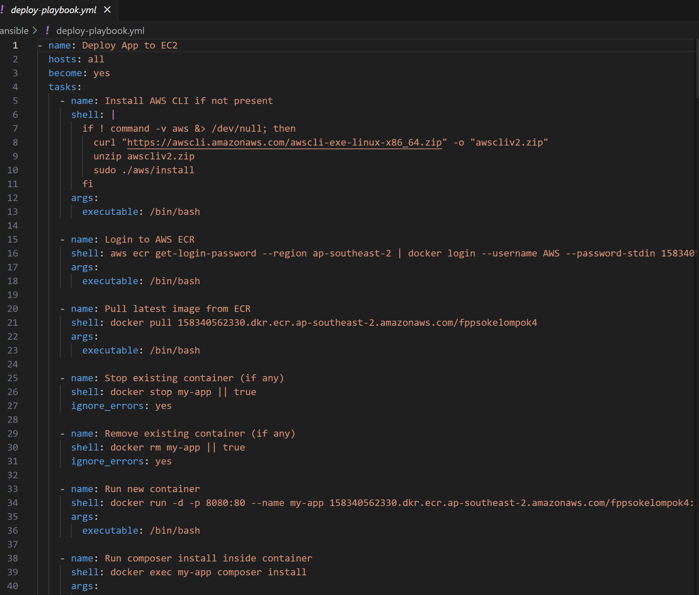

Untuk melakukan setup di server, pipeline akan mangakses SSH ke instance EC2 dengan key yang disimpan di GitHub Secret. Setelah SSH berhasil, selanjutnya akan dijalankan Ansible playbook yang berisi command line  pada gambar.
Tujuannya adalah memastikan image docker di pull dari ECR  dan dijalankan dalam docker container milik server. Terakhir, melakukan install dependency composer sehingga aplikasi bisa berjalan dengan benar.

### Server Running

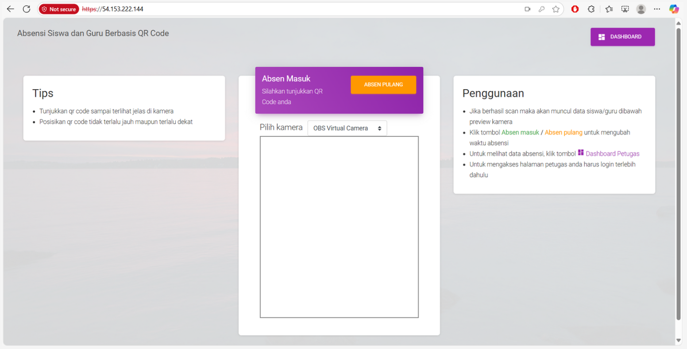

### Monitoring

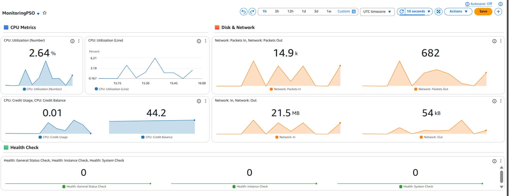

Amazon CloudWatch kami gunakan untuk memantau performa instance. Dashboard dibagi jadi tiga bagian utama: CPU Metrics, Disk & Network, dan Health Check, dengan update data tiap 10 detik untuk memastikan sistem tetap stabil.

## Pengembangan Fitur

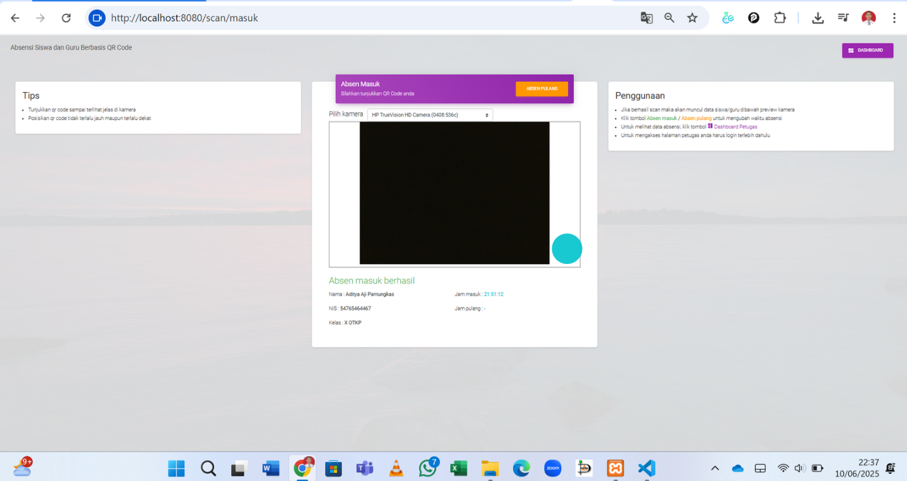

> ### Notifikasi via WhatsApp
>
> 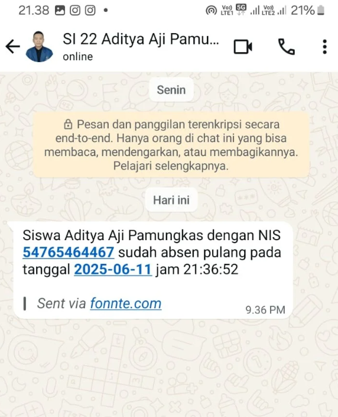

### Konfigurasi

> [!IMPORTANT]
>
> - Konfigurasi file `.env` untuk mengatur base url(terutama jika melakukan hosting), koneksi database dan pengaturan lainnya sesuai dengan lingkungan pengembangan Anda.
>
> - Untuk mengaktifkan **notifikasi WhatsApp**, pertama-tama ubah variabel `.env` berikut dari `false` menjadi `true`.
>
>   ```sh
>   # .env
>   # WA_NOTIFICATION=false # sebelum
>   WA_NOTIFICATION=true
>   ```
>
>   Lalu masukkan token WhatsApp API.
>
>   ```sh
>   # .env
>   WA_NOTIFICATION=true
>   WHATSAPP_PROVIDER=Fonnte
>   WHATSAPP_TOKEN=XXXXXXXXXXXXXXXXX # ganti dengan token anda
>   ```
>
>   _**Untuk mendapatkan token, daftar di website [fonnte](https://md.fonnte.com/new/register.php) terlebih dahulu. Lalu daftarkan device anda dan [dapatkan token Fonnte Whatsapp API](https://docs.fonnte.com/token-api-key/)**_
> 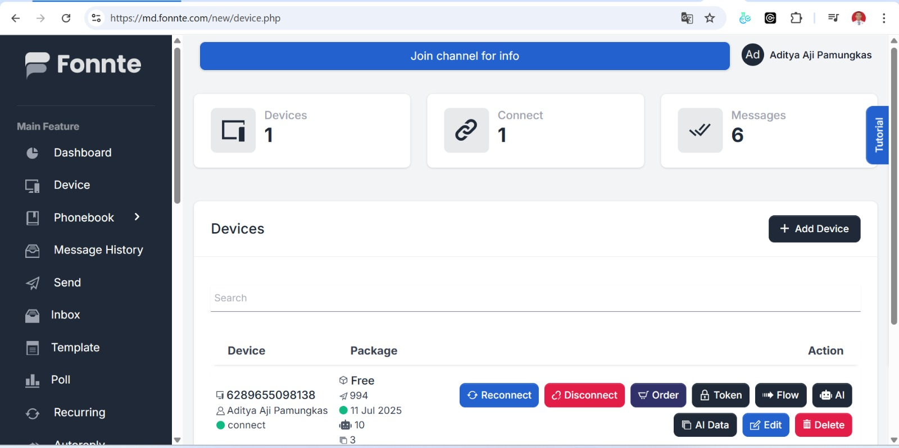
>
> - Untuk mengubah konfigurasi nama sekolah, tahun ajaran logo sekolah dll sudah disediakan pengaturan (khusus untuk superadmin).
>
> - Logo Sekolah Rekomendasi 100x100px atau 1:1 dan berformat PNG/JPG.
>
> - Jika ingin mengubah email, username & password dari superadmin, buka file `app\Database\Migrations\2023-08-18-000004_AddSuperadmin.php` lalu ubah & sesuaikan kode berikut:
>
>   ```php
>   // INSERT INITIAL SUPERADMIN
>   $email = 'adminsuper@gmail.com';
>   $username = 'superadmin';
>   $password = 'superadmin';
>   ```

## Cara Penggunaan di lokal

### Persyaratan

- [Composer](https://getcomposer.org/).
- PHP 8.1+ dan MySQL/MariaDB atau [XAMPP](https://www.apachefriends.org/download.html) versi 8.1+ dengan mengaktifkan extension `intl` dan `gd`.
- Pastikan perangkat memiliki kamera/webcam untuk menjalankan qr scanner. Bisa juga menggunakan kamera HP dengan bantuan software DroidCam.

### Instalasi

- Clone/Download source code proyek ini.

- Install dependencies yang diperlukan dengan cara menjalankan perintah berikut di terminal:

  ```shell
  composer install
  ```

- Jika belum terdapat file `.env`, rename file `.env.example` menjadi `.env`


- Buat database `db_absensi` di phpMyAdmin / mysql

- Ganti konfigurasi database default pada ‘.env’ dengan database di localhost phpMyAdmin

- Jalankan migrasi database untuk membuat struktur tabel yang diperlukan. Ketikkan perintah berikut di terminal:

  ```shell
  php spark migrate --all
  ```

- Atur baseURL di ‘.env’ menjadi ‘http://localhost:8080/` terlebih dahulu)
- Gunakan `php spark serve` untuk menjalankan 
- Lalu jalankan aplikasi di browser.
- Login menggunakan krendensial superadmin:

  ```txt
  username : superadmin
  password : superadmin
  ```

- Izinkan akses kamera.

## Kesimpulan

Dengan aplikasi web sistem absensi sekolah berbasis QR code ini, diharapkan proses absensi di sekolah menjadi lebih efisien dan terotomatisasi. Proyek ini dapat diadaptasi dan dikembangkan lebih lanjut sesuai dengan kebutuhan dan persyaratan sekolah Anda.


