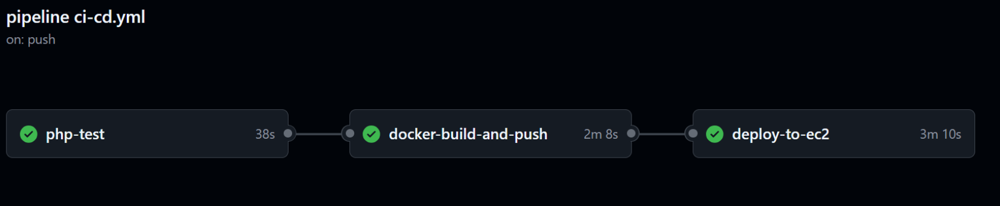

# Aplikasi Web Sistem Absensi Sekolah Berbasis QR Code

Aplikasi Web Sistem Absensi Sekolah Berbasis QR Code adalah sebuah proyek yang bertujuan untuk mengotomatisasi proses absensi di lingkungan sekolah menggunakan teknologi QR code. Aplikasi ini dikembangkan dengan menggunakan framework CodeIgniter 4 dan didesain untuk mempermudah pengelolaan dan pencatatan kehadiran siswa dan guru.


Proyek kami adalah implementasi pipeline CI/CD untuk aplikasi Sistem Presensi berbasis QR Code. Tujuannya adalah untuk mengotomatiskan seluruh proses, mulai dari saat kode diunggah ke GitHub, lalu secara otomatis diuji, dikemas dengan Docker, hingga di-deploy ke server. Dengan ini, kami bisa merilis pembaruan fitur dengan lebih cepat, efisien, dan andal.

## Fitur Utama

- **QR Code scanner.** Setiap siswa/guru menunjukkan qr code kepada perangkat yang dilengkapi dengan kamera. Aplikasi akan memvalidasi QR code dan mencatat kehadiran siswa ke dalam database.
- **Notifikasi Presensi via WhatsApp**. Setelah berhasil scan dan presensi, pemberitahuan dikirim ke nomor hp siswa melalui whatsapp.
- **Login petugas.**
- **Dashboard petugas.** Petugas sekolah dapat dengan mudah memantau kehadiran siswa dalam periode waktu tertentu melalui tampilan yang disediakan.
- **QR Code generator & downloader.** Petugas yang sudah login akan men-generate dan/atau mendownload qr code setiap siswa/guru. Setiap siswa akan diberikan QR code unik yang terkait dengan identitas siswa. QR code ini akan digunakan saat proses absensi.
- **Ubah data absen siswa/guru.** Petugas dapat mengubah data absensi setiap siswa/guru. Misalnya mengubah data kehadiran dari `tanpa keterangan` menjadi `sakit` atau `izin`.
- **Tambah, Ubah, Hapus(CRUD) data siswa/guru.**
- **Tambah, Ubah, Hapus(CRUD) data kelas.**
- **Lihat, Tambah, Ubah, Hapus(CRUD) data petugas.** (khusus petugas yang login sebagai **`superadmin`**).
- **Generate Laporan.** Generate laporan dalam bentuk pdf.
- **Import Banyak Siswa.** Menggunakan CSV delimiter koma (,), Contoh: [CSV](https://github.com/ikhsan3adi/absensi-sekolah-qr-code/blob/141ef728f01b14b89b43aee2c0c38680b0b60528/public/assets/file/csv_siswa_example.csv).

## Tools yang digunakan
Tentu, berikut adalah penjelasan untuk setiap tools yang digunakan dalam diagram alur kerja (workflow diagram) tersebut:

## Tools yang Digunakan
### GitHub
GitHub digunakan sebagai platform berbasis web yang menggunakan Git untuk kontrol versi. Dalam diagram ini, GitHub berfungsi sebagai repositori sentral untuk menyimpan, mengelola, dan melacak setiap perubahan pada kode sumber aplikasi.
### GitHub Actions
Github Actions digunakan untuk menjalankan pipeline CI/CD. Pipeline berfungsi sebagai proses otomasi yang menjalankan serangkaian langkah (seperti build, test, dan deploy) setiap kali ada perubahan kode di GitHub. Logo yang digunakan mirip dengan Bitbucket Pipelines atau bisa juga merepresentasikan konsep pipeline CI/CD secara umum (misalnya, Jenkins, GitHub Actions, dll.). Tujuannya adalah untuk mengintegrasikan dan mengirimkan kode secara berkelanjutan.
### Composer
Composer digunakan sebagai manajer dependensi (dependency manager) untuk bahasa pemrograman PHP. Dalam alur ini, pipeline menggunakan Composer untuk mengunduh dan menginstal semua pustaka (libraries) atau paket eksternal yang dibutuhkan oleh proyek aplikasi agar dapat berjalan dengan baik.
### PHPUnit
PHPUnit berfungsi sebagai kerangka kerja pengujian (testing framework) untuk PHP. Setelah Composer menginstal semua dependensi, PHPUnit secara otomatis menjalankan tes pada kode untuk memastikan tidak ada bug atau kesalahan dan semua fungsi berjalan sesuai harapan.
### Docker
Docker berfungsi sebagai platform untuk mengemas aplikasi beserta semua dependensinya (pustaka, runtime, tools) ke dalam sebuah unit standar yang disebut container. Dalam alur ini, kode dari GitHub "dibungkus" menjadi sebuah Docker image, yang memastikan aplikasi dapat berjalan secara konsisten di lingkungan mana pun.
### Amazon Elastic Container Registry (ECR)
ECR adalah layanan registry container Docker yang dikelola oleh Amazon Web Services (AWS). Setelah Docker image berhasil dibuat, gambar tersebut diunggah dan disimpan di ECR. Ini berfungsi sebagai tempat penyimpanan terpusat untuk semua versi image aplikasi.
### Ansible
Ansible digunakan sebagai alat otomasi open-source untuk manajemen konfigurasi dan penyebaran aplikasi. Dalam diagram ini, Ansible bertugas mengambil (pull) Docker image dari Amazon ECR dan secara otomatis melakukan deployment (menjalankan kontainer) ke server tujuan.
### Amazon Elastic Compute Cloud (EC2)
EC2 adalah layanan dari AWS yang menyediakan server virtual (virtual servers) yang dapat diskalakan di cloud. Di sinilah aplikasi yang sudah dikemas dalam kontainer Docker akan dijalankan dan diakses oleh pengguna.
### Amazon CloudWatch
CloudWatch adalah layanan pemantauan dan observabilitas dari AWS. Layanan ini mengumpulkan data log, metrik, dan events dari sumber daya AWS seperti EC2. Tujuannya adalah untuk memantau kinerja dan kesehatan aplikasi yang sedang berjalan, serta memberikan peringatan jika terjadi masalah.

## Pipeline Workflow DIagram


## Dokumentasi Screenshot Pipeline

### CI/CD Pipeline GitHub Actions



### Job php-test

| php-test di GitHub Actions                          |                       Code                      |
| -------------------------------------------------- | :----------------------------------------------: |
|  |  |

### Job docker-build-and-push

| docker-build-and-push di Github Action                          |                       Code                      |
| -------------------------------------------------- | :----------------------------------------------: |
|  |  |

### Job deploy-to-ec2

| deploy-to-ec2 di Github Action                          |                       Code                      |
| -------------------------------------------------- | :----------------------------------------------: |
|  |  |

### Dockerfile


### Server Running


## Pengembangan Fitur


> ### Notifikasi via WhatsApp
>
> 

## Cara Penggunaan di lokal

### Persyaratan

- [Composer](https://getcomposer.org/).
- PHP 8.1+ dan MySQL/MariaDB atau [XAMPP](https://www.apachefriends.org/download.html) versi 8.1+ dengan mengaktifkan extension `intl` dan `gd`.
- Pastikan perangkat memiliki kamera/webcam untuk menjalankan qr scanner. Bisa juga menggunakan kamera HP dengan bantuan software DroidCam.

### Instalasi

- Clone/Download source code proyek ini.

- Install dependencies yang diperlukan dengan cara menjalankan perintah berikut di terminal:

  ```shell
  composer install
  ```

- Jika belum terdapat file `.env`, rename file `.env.example` menjadi `.env`


- Buat database `db_absensi` di phpMyAdmin / mysql

- Ganti konfigurasi database default pada ‘.env’ dengan database di localhost phpMyAdmin

- Jalankan migrasi database untuk membuat struktur tabel yang diperlukan. Ketikkan perintah berikut di terminal:

  ```shell
  php spark migrate --all
  ```

- Atur baseURL di ‘.env’ menjadi ‘http://localhost:8080/` terlebih dahulu)
- Gunakan `php spark serve` untuk menjalankan 
- Lalu jalankan aplikasi di browser.
- Login menggunakan krendensial superadmin:

  ```txt
  username : superadmin
  password : superadmin
  ```

- Izinkan akses kamera.

## Kesimpulan

Dengan aplikasi web sistem absensi sekolah berbasis QR code ini, diharapkan proses absensi di sekolah menjadi lebih efisien dan terotomatisasi. Proyek ini dapat diadaptasi dan dikembangkan lebih lanjut sesuai dengan kebutuhan dan persyaratan sekolah Anda.

